# opkssh Deployment Tracker

A comprehensive system for managing and tracking OpenPubkey SSH (opkssh) deployments across multiple Linux hosts.

> [!note] Disclaimer
> This project is not affiliated with the official opkssh or pocket-id projects. It is an independent tool designed to facilitate the deployment and management of opkssh installations.


## Overview

This system consists of:

- **Tracking Server** - A centralized FastAPI server that tracks opkssh deployments via HTTP API
- **Deployment Scripts** - Automated bash scripts for deploying opkssh to remote Linux hosts
- **Client Utilities** - Tools for reporting status and generating SSH configurations

## About the Required Projects

This deployment tracker depends on two awesome open-source projects:

### 🔐 opkssh - OpenPubkey SSH

[**opkssh**](https://github.com/openpubkey/opkssh) is a SSH authentication system that eliminates the need for traditional SSH keys by leveraging OpenID Connect (OIDC) for authentication. Instead of managing SSH key pairs, users authenticate with their existing OIDC provider (like Google, Microsoft, or self-hosted solutions), and opkssh automatically generates cryptographic proofs that authorize SSH access.

**Why opkssh?**
- ✅ **No SSH key management** - No more lost keys, key rotation headaches, or distributing public keys
- ✅ **Centralized identity** - Use your existing OIDC provider for authentication
- ✅ **Enhanced security** - Cryptographic proofs based on modern OIDC standards
- ✅ **Audit trail** - Every SSH connection is tied to a verified identity
- ✅ **Easy revocation** - Disable access by removing OIDC permissions, no need to update authorized_keys files

Learn more: [github.com/openpubkey/opkssh](https://github.com/openpubkey/opkssh)

### 🆔 Pocket ID - Self-Hosted OIDC Provider

[**Pocket ID**](https://github.com/pocket-id/pocket-id) is a lightweight, self-hosted OpenID Connect (OIDC) provider that gives you complete control over your authentication infrastructure. Perfect for homelab enthusiasts, small businesses, and anyone who wants to avoid vendor lock-in with cloud identity providers.

**Why Pocket ID?**
- ✅ **Self-hosted** - Full control over your identity provider, no third-party dependencies
- ✅ **Privacy-focused** - Your authentication data stays on your infrastructure
- ✅ **Easy setup** - Docker-based deployment with minimal configuration
- ✅ **Standards-compliant** - Full OIDC implementation compatible with any OIDC-aware application
- ✅ **Passkey Only** - Use Passkeys for authentication instead of Passwords
- ✅ **Perfect for opkssh** - Designed to work seamlessly with modern authentication systems
- ✅ **No vendor lock-in** - Own your identity infrastructure

Learn more: [github.com/pocket-id/pocket-id](https://github.com/pocket-id/pocket-id)

### How They Work Together

This deployment tracker integrates these technologies to provide a complete SSH management solution:

1. **Pocket ID** (or any OIDC provider) handles user authentication
2. **opkssh** uses OIDC tokens to authorize SSH connections without traditional keys
3. **This tracker** helps you deploy and manage opkssh across your infrastructure

The result? Secure, modern SSH authentication without the hassle of key management!

## Table of Contents

- [About the Required Projects](#about-the-required-projects)
- [Server Setup](#server-setup)
- [Web Dashboard](#web-dashboard)
  - [Main Dashboard Overview](#main-dashboard-overview)
  - [Bootstrap Deployment Feature](#bootstrap-deployment-feature)
  - [Deployment Management](#deployment-management)
  - [SSH Config Generator](#ssh-config-generator)
  - [API Documentation](#api-documentation)
- [Client Scripts Usage](#client-scripts-usage)
- [Configuration](#configuration)
- [API Endpoints](#api-endpoints)
- [Troubleshooting](#troubleshooting)

---

## Changes

Latest changes can be found in the [Changelog](CHANGELOG.md)

## Server Setup

The tracking server runs as a Docker container using a pre-built image.

### Prerequisites

- Docker and Docker Compose installed
- A Linux host or server to run the tracker
- Ports: 8080 (or your chosen port) available
- OIDC Provider for authentication (e.g. Pocket ID, Auth0, Keycloak)
  Required OIDC details:
  - Issuer URL
  - Client ID
  - Expiry duration
- Account on your OIDC provider for authentication


### Quick Start

1. **Checkout this repository:**
   ```bash
   git clone git@github.com:Basti-Fantasti/opkssh-deployment-tracker.git
   cd opkssh-deployment-tracker
   ```

2. **Create configuration file:**
   ```bash
   cp config.toml.example config.toml
   ```

3. **Edit the configuration:**
   ```bash
   nano config.toml  # or use your preferred editor
   ```

   **Important:** Change the default password!
   ```toml
   [auth]
   enabled = true
   username = "admin"
   password = "your-secure-password-here"  # CHANGE THIS!
   ```

4. **Create data directory:**
   ```bash
   mkdir -p data
   ```

5. **Start the server:**
   ```bash
   docker-compose up -d
   ```

6. **Verify the server is running:**
   ```bash
   docker-compose logs -f
   ```

   Or check the health endpoint:
   ```bash
   curl http://localhost:8080/health
   ```

7. **Access the web dashboard:**
   Open your browser and navigate to: `http://your-server-ip:8080`

### Server Management

**View logs:**
```bash
docker-compose logs -f
```

**Stop the server:**
```bash
docker-compose down
```

**Restart the server:**
```bash
docker-compose restart
```

**Update to latest version:**
```bash
docker-compose pull
docker-compose up -d
```

---

## Web Dashboard

The opkssh Deployment Tracker provides a comprehensive web-based dashboard for managing your deployments. Access it at `http://your-server-ip:8080` after starting the server.

### Main Dashboard Overview

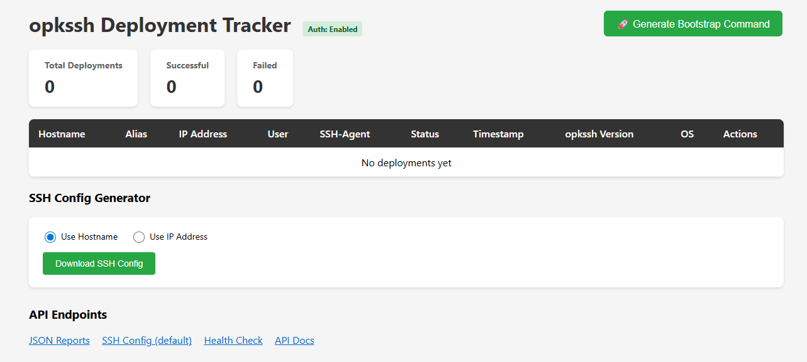

The main dashboard provides:
- **Deployment Statistics** - Quick overview showing total deployments, successful deployments, and failed deployments
- **Deployment Table** - Comprehensive view of all tracked hosts with columns for:
  - Hostname (clickable to view deployment history)
  - Alias (friendly name for SSH config)
  - IP Address
  - SSH User
  - SSH-Agent forwarding status (toggle on/off per host)
  - Deployment Status (success/incomplete/failed)
  - Timestamp of last report
  - opkssh Version installed
  - Operating System information
  - Actions (Edit/Delete buttons)
- **Generate Bootstrap Command** button for one-command deployments
- **SSH Config Generator** with hostname/IP mode selection
- **API Endpoints** quick access links

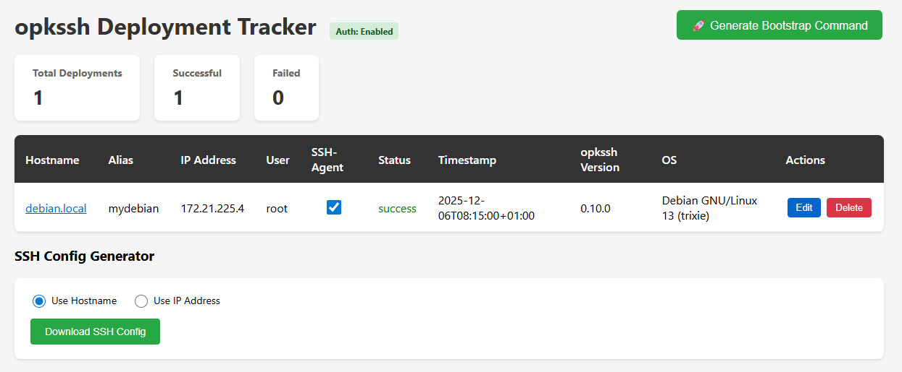

Once you have deployments tracked, the dashboard shows all deployment details in an organized table. The hostname is clickable to view the complete deployment history timeline for that host.

### Bootstrap Deployment Feature

The bootstrap deployment feature enables one-command opkssh installation without manual script distribution or configuration files.

#### Generate Bootstrap Command

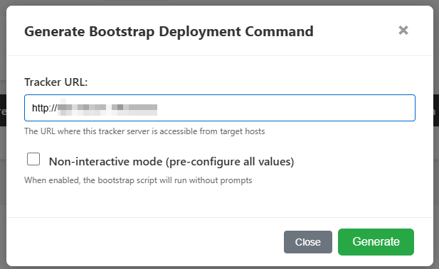

Click the "Generate Bootstrap Command" button to open the bootstrap modal where you can:
- View the tracker URL (automatically populated)
- Enable **Non-interactive mode** to pre-configure all deployment values for fully automated installation
- Generate a time-limited deployment token

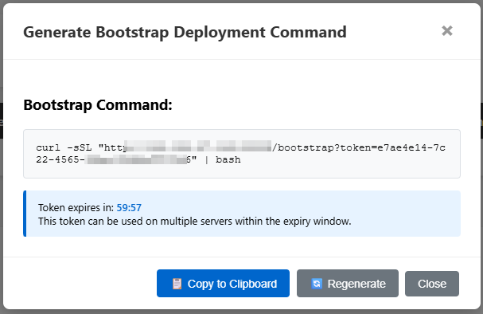

After clicking "Generate", you receive:
- A ready-to-use `curl | bash` command
- Token expiry countdown (default: 1 hour)
- One-click "Copy to Clipboard" functionality
- Option to regenerate the token
- Reusable token - use the same command on multiple servers within the expiry window

#### Bootstrap Script in Action

**On a fresh system without opkssh:**

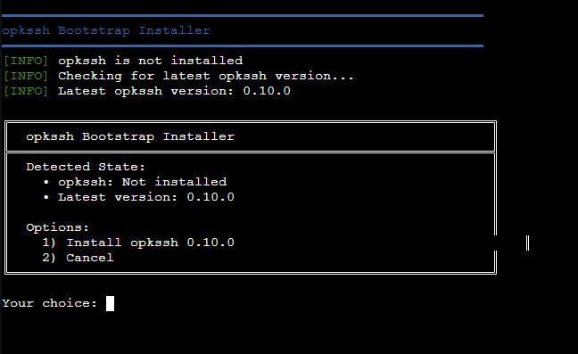

The bootstrap script automatically:
- Detects that opkssh is not installed
- Checks the latest available version
- Presents a clean menu with options to install or cancel

**On a system with existing opkssh installation:**

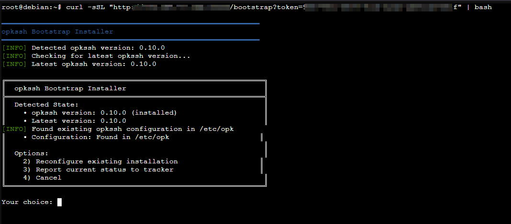

The smart bootstrap script:
- Detects the installed opkssh version
- Checks for available updates
- Finds existing configuration in `/etc/opk`
- Offers context-aware options:
  - Reconfigure existing installation
  - Report current status to tracker
  - Cancel

**Installation and Configuration Process:**

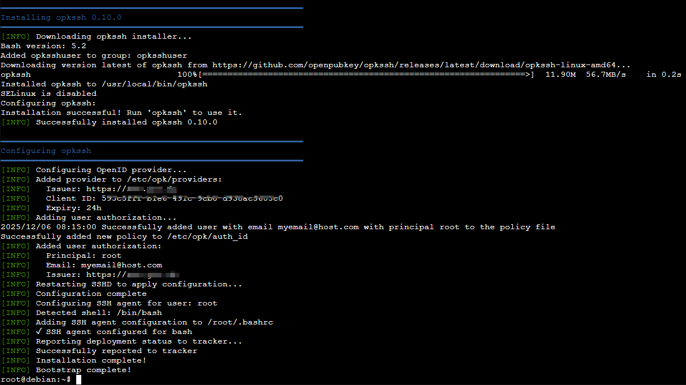

The bootstrap script handles the complete deployment process:
1. Downloads and installs opkssh
2. Configures OpenID provider settings
3. Sets up user authorization
4. Configures SSHD for opkssh authentication
5. Sets up SSH agent forwarding (with multi-shell support: bash, zsh, fish)
6. Reports deployment status to the tracker
7. All with detailed progress feedback and error handling

**Reporting to Tracker:**

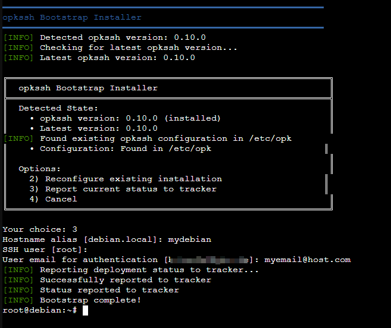

After installation or when using the "Report status" option, the script:
- Collects hostname, alias, IP, user, and configuration details
- Reports deployment status to the tracker server
- Confirms successful registration

### Deployment Management

#### Edit Deployments

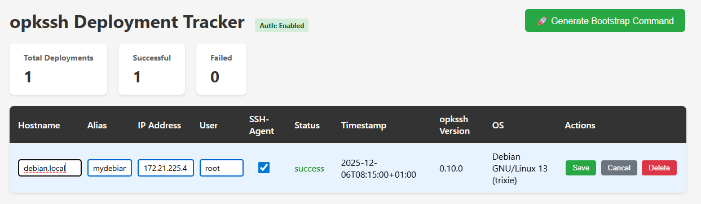

Click the "Edit" button on any deployment to modify:
- Hostname
- Alias (friendly name)
- IP Address
- SSH User
- Changes are saved immediately with visual feedback

#### Delete Deployments

Each deployment row has a "Delete" button that:
- Shows a confirmation dialog before deletion
- Immediately removes the deployment from the tracker
- Updates the dashboard statistics

#### Toggle SSH Agent Forwarding

The "SSH-Agent" column contains checkboxes that allow you to:
- Enable/disable SSH agent forwarding per host
- Changes are saved automatically via API
- Affects the generated SSH config (`ForwardAgent yes/no`)

### SSH Config Generator

The tracker can generate OpenSSH configuration for all successful deployments.

**Using IP Address Mode:**

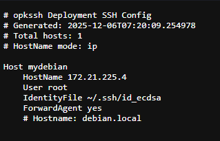

Select "Use IP Address" to generate SSH config with:
- IP address in the `HostName` field
- Hostname shown as a comment
- Perfect for environments where DNS is unreliable

**Using Hostname Mode:**

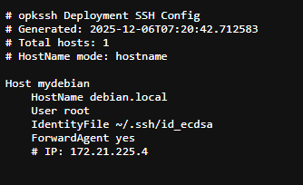

Select "Use Hostname" to generate SSH config with:
- Hostname in the `HostName` field
- IP address shown as a comment
- Ideal when you have proper DNS resolution

Both modes include:
- User configuration
- Identity file path
- SSH agent forwarding setting (when enabled)
- Timestamp of generation

Click "Download SSH Config" to download the configuration file, which can be:
- Copied directly into `~/.ssh/config`
- Used with the `update-ssh-config.sh` script for automatic integration

### API Documentation

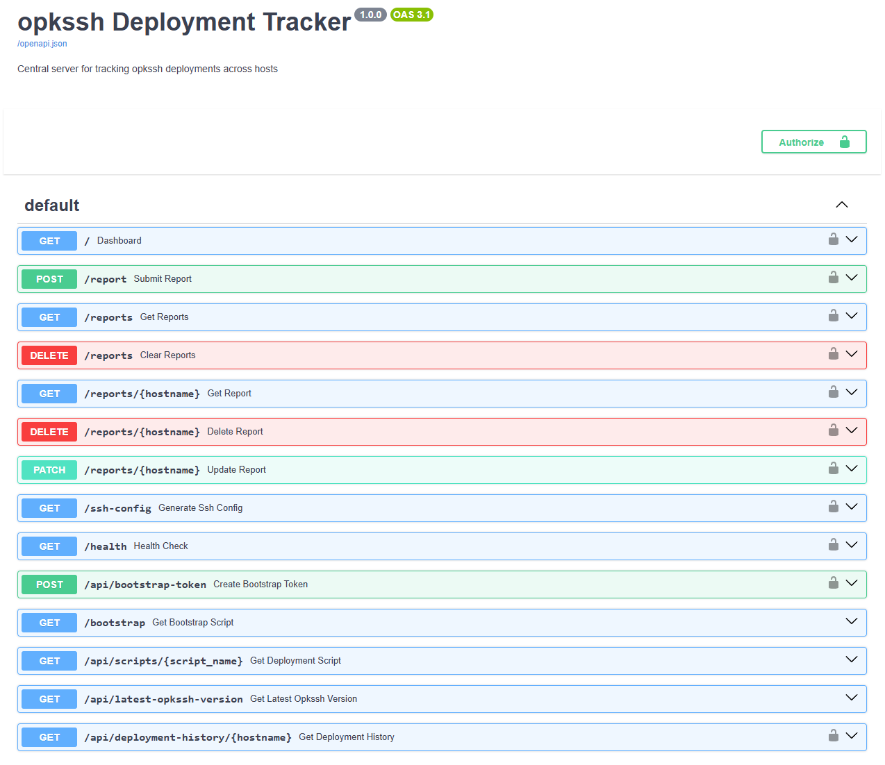

The dashboard provides access to interactive API documentation at `/openapi.json`, showing all available endpoints:
- **POST /report** - Submit deployment reports
- **GET /reports** - Retrieve all deployment reports
- **DELETE /reports** - Clear all reports
- **GET /reports/{hostname}** - Get specific deployment
- **DELETE /reports/{hostname}** - Delete specific deployment
- **PATCH /reports/{hostname}** - Update deployment (e.g., SSH agent setting)
- **GET /ssh-config** - Generate SSH configuration
- **GET /health** - Health check endpoint
- **POST /api/bootstrap-token** - Create bootstrap deployment token
- **GET /bootstrap** - Download bootstrap installation script
- **GET /api/scripts/{script_name}** - Download deployment scripts
- **GET /api/latest-opkssh-version** - Get latest opkssh version from GitHub
- **GET /api/deployment-history/{hostname}** - View deployment timeline

Each endpoint shows authentication requirements (lock icon) and supports the OpenAPI/Swagger specification.

---

### Configuration Options

Edit `config.toml` to customize:

```toml
[server]
host = "0.0.0.0"  # Bind to all interfaces
port = 8080       # Default port

[auth]
enabled = true              # Enable/disable authentication
username = "admin"          # Basic auth username
password = "change-me"      # Basic auth password

[ssh_config]
default_use_hostname = true  # Use hostname (true) or IP (false) in SSH config
```

After changing configuration, restart the server:
```bash
docker-compose restart
```

---

## Client Scripts Usage

The client scripts are used on your local machine to deploy opkssh to remote hosts and manage SSH configurations.

All scripts can be found in the `scripts/` directory.

### Prerequisites

- Bash shell
- `curl` and `wget` installed
- `sudo` access (for deployment script)
- SSH or physical/direct access to target hosts

### 1. Deploy opkssh to a Remote Host

The `deploy-opkssh.sh` script installs and configures opkssh on a Debian-based Linux host.

#### Setup (First Time)

1. **Create your .env file:**
   ```bash
   cp .env.example .env
   ```

2. **Configure your environment:**
   ```bash
   nano .env  # or use your preferred editor
   ```

   Edit the following variables:
   ```bash
   # Tracker server URL
   TRACKER_URL="http://your-tracker-server:8080"

   # Tracker authentication
   TRACKER_USER="admin"
   TRACKER_PASS="your-password"

   # Default SSH principal
   DEFAULT_PRINCIPAL="root"

   # OpenID Provider Configuration
   PROVIDER_ISSUER="https://auth.yourdomain.com"
   PROVIDER_CLIENT_ID="your-client-id"
   PROVIDER_EXPIRY="24h"
   USER_EMAIL="your-email@yourdomain.com"
   ```

#### Usage

**Interactive deployment (prompts for username):**
```bash
ssh user@target-host
sudo ./deploy-opkssh.sh
```

**Non-interactive deployment (automated):**
```bash
ssh root@target-host
sudo ./deploy-opkssh.sh --user root --alias webserver-01
```

**With custom alias:**
```bash
sudo ./deploy-opkssh.sh --alias db-server-prod
```

**Options:**
- `--user USERNAME` - Local username/principal for SSH access (default: root)
- `--alias ALIAS` - Friendly alias for SSH config (default: hostname)
- `--tracker-url URL` - Override tracker URL from .env
- `--tracker-user USER` - Override tracker username from .env
- `--tracker-pass PASS` - Override tracker password from .env
- `--help` - Show help message

### 2. Report Existing Installation

The `report-opkssh.sh` script analyzes an existing opkssh installation and reports it to the tracker.

**Usage:**

```bash
./report-opkssh.sh
```

**With options:**
```bash
./report-opkssh.sh --alias production-db --status success
```

**Dry run (show what would be reported):**
```bash
./report-opkssh.sh --dry-run
```

**Options:**
- `--alias ALIAS` - Set a friendly alias
- `--status STATUS` - Override detected status (success/incomplete/failed)
- `--tracker-url URL` - Override tracker URL from .env
- `--tracker-user USER` - Override tracker username
- `--tracker-pass PASS` - Override tracker password
- `--dry-run` - Show report without sending
- `--help` - Show help message

### 3. Update Local SSH Config

The `update-ssh-config.sh` script fetches deployment data from the tracker and updates your `~/.ssh/config` file.

**Usage:**

**Basic usage:**
```bash
./update-ssh-config.sh
```

**With custom prefix:**
```bash
./update-ssh-config.sh --prefix "opk-"
```
This creates SSH hosts like: `opk-webserver-01`

**With custom identity file:**
```bash
./update-ssh-config.sh --identity-file ~/.ssh/my_opk_key
```

**Dry run (preview changes):**
```bash
./update-ssh-config.sh --dry-run
```

**Options:**
- `--prefix PREFIX` - Add prefix to host aliases (e.g., "opk-")
- `--identity-file FILE` - Path to SSH identity file (default: ~/.ssh/id_ecdsa)
- `--config FILE` - SSH config file to update (default: ~/.ssh/config)
- `--tracker-url URL` - Override tracker URL from .env
- `--tracker-user USER` - Override tracker username
- `--tracker-pass PASS` - Override tracker password
- `--no-backup` - Don't create backup of existing config
- `--dry-run` - Preview changes without applying
- `--help` - Show help message

**After updating, SSH to your hosts:**
```bash
ssh root@webserver-01
# or with prefix:
ssh root@opk-webserver-01
```

---

## Configuration

### Environment Variables (.env)

Copy `.env.example` to `.env` and configure:

```bash
# Tracker Server
TRACKER_URL="http://your-tracker-server:8080"
TRACKER_USER="admin"
TRACKER_PASS="your-password"

# Default Settings
DEFAULT_PRINCIPAL="root"

# OpenID Provider (required for deploy-opkssh.sh)
PROVIDER_ISSUER="https://auth.yourdomain.com"
PROVIDER_CLIENT_ID="your-client-id-here"
PROVIDER_EXPIRY="24h"
USER_EMAIL="your-email@yourdomain.com"
```

### Server Configuration (server/config.toml)

```toml
[server]
host = "0.0.0.0"
port = 8080

[auth]
enabled = true
username = "admin"
password = "secure-password"

[ssh_config]
default_use_hostname = true
```

---

## API Endpoints

The tracker server provides the following REST API endpoints:

### `POST /report`
Submit a deployment report.

**Requires authentication if enabled.**

**Request body:**
```json
{
  "hostname": "webserver-01",
  "alias": "web-prod",
  "ip": "192.168.1.100",
  "user": "root",
  "status": "success",
  "opkssh_version": "0.3.0",
  "os_info": "Debian 12",
  "error": ""
}
```

### `GET /reports`
Get all deployment reports.

**Requires authentication if enabled.**

**Response:**
```json
[
  {
    "hostname": "webserver-01",
    "alias": "web-prod",
    "ip": "192.168.1.100",
    "user": "root",
    "status": "success",
    "opkssh_version": "0.3.0",
    "os_info": "Debian 12",
    "timestamp": "2025-01-15T10:30:00Z",
    "error": ""
  }
]
```

### `GET /reports/{hostname}`
Get a specific deployment report by hostname.

**Requires authentication if enabled.**

### `DELETE /reports/{hostname}`
Delete a deployment report.

**Requires authentication if enabled.**

### `GET /ssh-config`
Generate SSH config for all successful deployments.

**Requires authentication if enabled.**

**Query parameters:**
- `identity_file` - SSH identity file path (default: ~/.ssh/id_ecdsa)
- `prefix` - Prefix for host aliases (optional)
- `use_hostname` - Use hostname instead of IP (default: true)

**Response:** OpenSSH config format text

### `GET /health`
Health check endpoint (no authentication required).

### `GET /`
Web dashboard showing all deployments with statistics.

---

## Troubleshooting

### Server Issues

**Container won't start:**
```bash
# Check logs
docker-compose logs

# Check if port is already in use
netstat -tulpn | grep 8080

# Check config file syntax
cat config.toml
```

**Can't access web dashboard:**
- Verify the server is running: `docker-compose ps`
- Check firewall rules: `sudo ufw status`
- Verify port binding: `netstat -tulpn | grep 8080`

**Authentication failures:**
- Verify credentials in `server/config.toml`
- Verify credentials in `.env` match server config

### Client Script Issues

**"Missing required configuration variables":**
- Ensure `.env` file exists
- Verify all required variables are set in `.env`
- Check variable names match exactly (case-sensitive)

**"opkssh is not installed":**
- The deployment script installs opkssh automatically
- For report script, opkssh must already be installed
- Verify with: `which opkssh`

**SSH config not updating:**
- Check tracker URL is accessible: `curl http://tracker:8080/health`
- Verify authentication credentials
- Try with `--dry-run` first to preview changes
- Check `~/.ssh/config` permissions: `ls -la ~/.ssh/config`

**"Authentication failed":**
- Verify `TRACKER_USER` and `TRACKER_PASS` in `.env`
- Verify they match `server/config.toml`
- Check if auth is enabled: `[auth] enabled = true`

### Network Issues

**Can't reach tracker from clients:**
```bash
# Test connectivity
curl http://your-tracker-server:8080/health

# With authentication
curl -u admin:password http://your-tracker-server:8080/health

# Check DNS resolution
nslookup your-tracker-server

# Check network route
traceroute your-tracker-server
```

---

## Security Considerations

1. **Change default passwords** - Always change the default password in `server/config.toml`
2. **Use HTTPS** - Consider putting the tracker behind a reverse proxy with SSL/TLS
3. **Firewall rules** - Restrict access to port 8080 to known client IPs
4. **Keep .env private** - Never commit `.env` to version control
5. **Regular updates** - Update the Docker image regularly: `docker-compose pull && docker-compose up -d`

---

## Support

For issues, questions, or contributions, open an issue in this repo.

---

## License

See LICENSE file for details.
